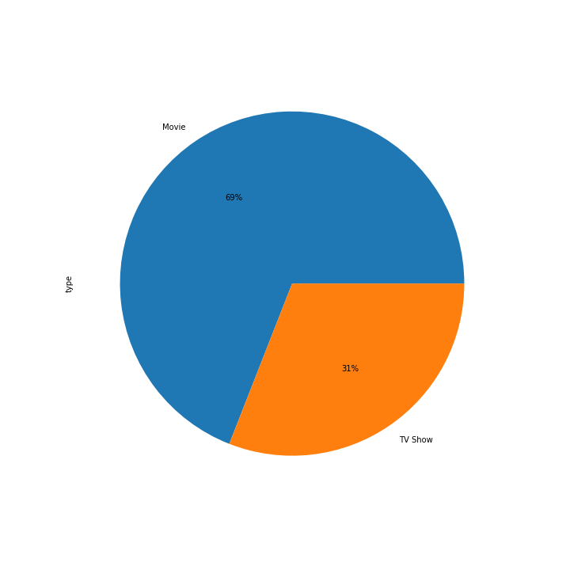
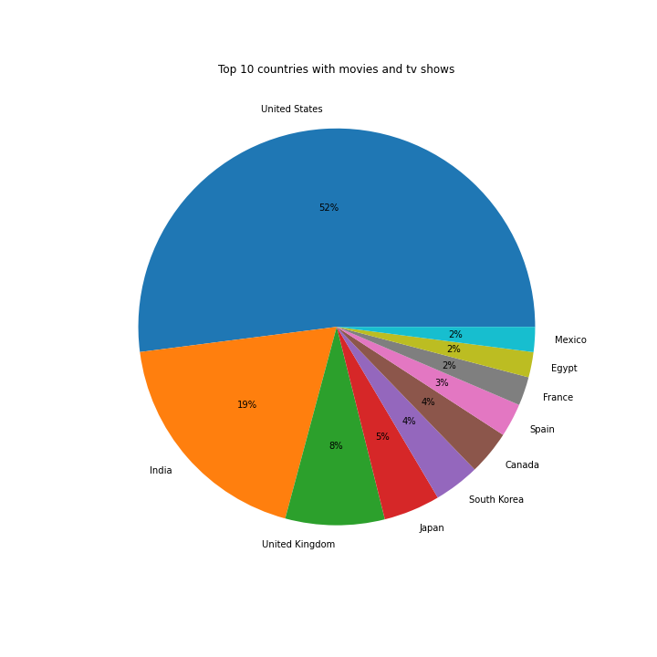
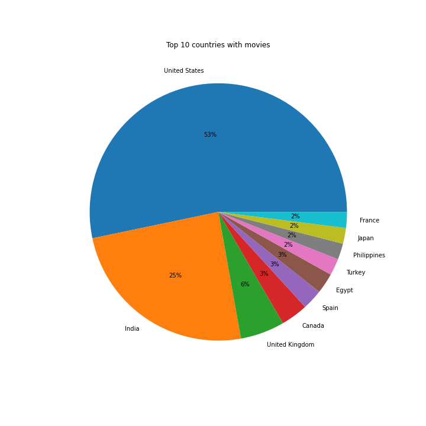
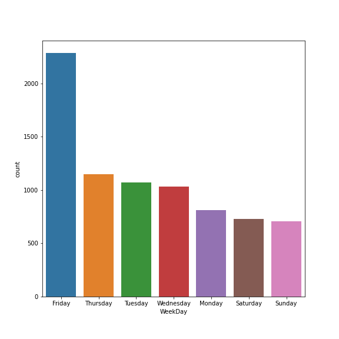

# EDA-on-Netflix
## Visualizing and gaining insights from Netflix data

In the given data, the percentage of TV show and movies were  

United States leads with highest number of movies and tv shows followed by India

In a given week, Friday saw the highest numbers of content upload probably because of the start of the weekend

